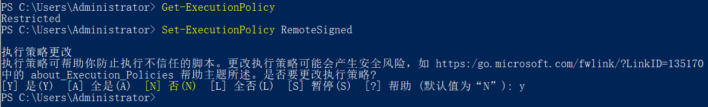
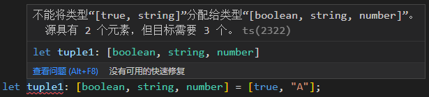
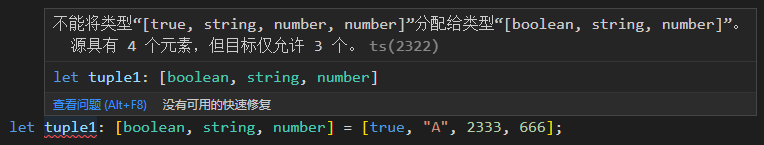
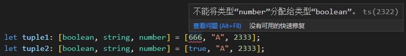

TypeScript 知识分享
---

# 一、概述

TypeScript（简称TS） 是由 Microsoft 开发的、基于 JavaScript（简称JS） 的语言，可以被看作是 **JavaScript 的一个超集**。

## 1.1 TypeScript 与 JavaScript 的关系

- TS 和 JS 之间的关系其实就像 Less/Sass 和 CSS 之间的关系：
Less/Sass 是对 CSS 的扩展，TS 也是对 JS 的扩展，
Less/Sass 最终会转换成 CSS，TS 代码最终也会转换成 JS。
- 所有的合法 JavaScript 代码都是合法的 TypeScript 代码，可以在 TypeScript 中直接使用 JavaScript 代码。
- JavaScript 是**弱类型**，很多错误只有在运行时才会被发现。
TypeScript 是**强类型**，它提供了一套静态检测机制，可以帮助我们在编译时就发现错误。

## 1.2 TypeScript特点

- 支持 Java, C#, C++ 等后端语言中的特性，例如枚举、泛型、类型转换、命名空间、声明文件、类、接口等
- 支持代码静态检查
- 支持 ECMAScript 的新特性，例如装饰器等

## 1.3 为什么要学习TypeScript？

- 学习成本低（入门简单，精通也难）
- 能减少团队无效沟通
- 能让代码更健壮
- 有助于快速掌握其它后端语言
- ......

# 二、使用步骤

## 2.1 安装 TypeScript

```
npm install -g typescript
```

## 2.2 编译 TypeScript 文件

### 2.2.1 编译指定 ts 文件

```powershell
tsc src/index.ts
```

<details>
<summary>
<font size="2">
常见报错：tsc : 无法加载文件 C:\Users\Administrator\AppData\Roaming\npm\tsc.ps1，因为在此系统上禁止运行脚本。
</font>
</summary>

<font size="2">因为我们的系统执行策略（Execution Policy）禁止在系统上运行PowerShell脚本。
要解决此问题，可以尝试以下步骤：
1、按下【Win+X】，选择【Windows PowerShell（管理员）】，注意，需要带【管理员】后缀的WIndows PowerShell。
2、查看系统的执行策略，如果输出结果是Restricted，则说明系统禁止执行任何PowerShell脚本。
```powershell
Get-ExecutionPolicy
```
3、使用以下命令来将执行策略设置为RemoteSigned，允许您在系统上执行本地脚本。
```powershell
Set-ExecutionPolicy RemoteSigned
```
</font>


</details>

#### 示例

编译前

```ts
// 可以完全按照 JavaScript 标准语法编写代码
const hello = name => {
  console.log(`Hello,${name}`)
}
hello('TypeScript')
```

编译后

```js
var hello = function (name) {
    console.log("Hello,".concat(name));
};
hello('TypeScript');
```

tsc 命令不仅仅可以编译指定的某个 ts 文件，还可以编译整个项目。

### 2.2.2 编译整个项目

```powershell
tsc
```

### 2.2.3 配置文件

创建 TypeScript 配置文件

```powershell
tsc --init
```

执行命令后，会生成一个 tsconfig.json 文件。

文件中 **compilerOptions** 是 TypeScript 编译器的选项。

##### 常用的 compilerOptions 选项

**target**： 设置编译过后 Javascript 所采用的 ECMA 标准

**module**： 输出的代码采用什么样的方式去进行模块化

**outDir**： 编译结果输出到的文件夹，一般会输出到 dist 文件夹

**rootDir**： 配置源代码，也就是 Typescript 代码所在的文件夹，一般放在src目录

**sourceMap**： 是否开启源代码映射，开启之后，调试的时候可以通过 sourceMap 文件进行源代码调试

**strict**： 开启所有严格检查选项，严格模式下，需要我们对每一个成员都要指定明确的类型等等

**_注意，如果还是使用 tsc 编译某个 ts 文件，配置文件是不起作用的，只有当直接运行 tsc 命令去编译整个项目时，配置文件才生效。_**


# 三、TypeScript 类型

## 3.1 基础类型

### 3.1.1 Boolean 类型

```ts
let isDone: boolean = false; // ES5: var isDone = false;
```

### 3.1.2 Number 类型

```ts
let count: number = 10; // ES5: var count = 10;
```

### 3.1.3 String 类型

```ts
let name: string = "Java"; // ES5: var name = 'Java';
```

## 3.2 数组和元组类型

### 3.2.1 单一类型的数组

```ts
let arr1: Array<number> = [1, 2, 3]; // ES5: var arr1 = [1, 2, 3];
let arr2: number[] = [1, 2, 3]; // ES5: var arr2 = [1, 2, 3];
let arr3: Array<string> = ["A", "B", "C"]; // ES5: var arr3 = ["A", "B", "C"];
let arr4: string[] = ["A", "B", "C"]; // ES5: var arr4 = ["A", "B", "C"];
```
### 3.2.2 联合类型的数组

```ts
let arr5: Array<boolean | string | number> = [1, "A", true]; // ES5: var arr5 = [1, "A", true];
let arr6: (boolean | string | number)[] = [1, "A", true]; // ES5: var arr6 = [1, "A", true];
```

### 3.2.3 任意类型的数组

```ts
let arr7: Array<any> = [1, "A", null]; // ES5: var arr7 = [1, "A", null];
let arr8: any[] = [1, "A", null]; // ES5: var arr8 = [1, "A", null];
```

### 3.2.4 元祖（Tuple）

TS中的元祖类型是数组类型的扩展，是**明确元素数量以及每个元素类型的数组**。

元祖有以下特点：
1. 明确知道包含了多少元素（这里的元素指的是类型）
2. 明确知道每个类型所在的位置
3. 长度固定，元组类型的变量需要为每一个位置定义对应类型的值

总而言之，元祖赋值的元素类型必须和类型注解**一一对应**。

与数组一样，我们可以通过下标来访问元组中的元素。

```ts
let tuple1: [boolean, string, number] = [666, "A", 2333]; // 报错
let tuple2: [boolean, string, number] = [true, "A", 2333];
console.log(tuple2[2]); // 2333
```

<details>
<summary>错误示例</summary>




</details>

### 3.2.5 不可变元组（Immutable Tuple）

不可变元组的意思是元组类型的变量内的元素值是不可变的，也就是不可再增加元素、删除元素、修改元素值。

想要让一个元祖拥有这个特性，有两种办法：

```ts
// 1.在元祖类型字面量前加 readonly 关键字（注意不能加在类型变量名前）
type tupleTypeDemo = readonly [string, number];

// 2.给数组类型的变量（注意：不是类型）后加 const 断言，改为 “常量”
let demo = [
  {
    item: {
      name: "不可变",
    },
  },
  2333,
] as const;

demo[0].item.name = 1; // error: 无法为“name”赋值，因为它是只读属性。
demo.push(2); // error: 类型“readonly [{ readonly item: { readonly name: "不可变"; }; }, 2]”上不存在属性“push”。
demo.splice(0, 1); // error: 属性“splice”在类型“readonly [{ readonly item: { readonly name: "不可变"; }; }, 2]”上不存在。
demo.pop(); // error: 类型“readonly [{ readonly item: { readonly name: "不可变"; }; }, 2]”上不存在属性“pop”。
demo.unshift(); // error: 类型“readonly [{ readonly item: { readonly name: "不可变"; }; }, 2]”上不存在属性“unshift”。
```

### 3.2.6 元组合并

```ts
type tupleFirst = [number];
type tupleSecond = [string];
type intersectionTuple = [...tupleFirst, ...tupleSecond]; // [number, string]
```

## 3.3 枚举类型

### 3.3.1 枚举的基本概念

枚举类型是TS为JS扩展的一种类型，在原生JS中是没有枚举类型的。

TS中的枚举类型是对包含有限数量的命名常量的集合的数据类型的**统称**。每一个定义出来的枚举都是独立的TS类型。

枚举的作用：
1. 定义一组具有意义的常量，可以通过名称或值调用这些常量，提高代码的可读性和可维护性
2. 作为一种类型，用做类型注解

<details>
<summary>扩展知识</summary>

绝大部分 TypeScript 的特性都遵循类型级别扩展的法则，而枚举打破了这个法则。
（类型级别扩展的法则：要得到 JavaScript 代码，只需要去掉类型标准即可。）

[TypeScript 的 enum 是一种错误吗？](https://www.zhihu.com/question/60168510/answer/2320750226)
[enum 虽好，但我选择 Const Assertions](https://www.zhihu.com/question/60168510/answer/733352978)
</details>

### 3.3.2 枚举的基本语法

TS中枚举使用关键字“enum”来定义一个新的枚举类型。

枚举类型有三种定义方式：数字枚举、字符串枚举、异构枚举（数字和字符串混合）。

- 数字枚举的取值，默认是从上至下从0开始递增，也可以手动指定枚举值。
- 数字枚举如果手动指定了前面的枚举值，那么后面的枚举值会根据前面的值来递增。

示例：
```ts
enum Direction {
  EAST,
  SOUTH,
  WEST,
  NORTH,
}

enum StringEnumDemo {
  A = "aaa",
  B = "bbb",
}

enum MixEnum {
  A = "aaa",
  B = 2,
}
```
编译后
```js
var Direction;
(function (Direction) {
  Direction[Direction["EAST"] = 0] = "EAST";
  Direction[Direction["SOUTH"] = 1] = "SOUTH";
  Direction[Direction["WEST"] = 2] = "WEST";
  Direction[Direction["NORTH"] = 3] = "NORTH";
})(Direction || (Direction = {}));

var StringEnumDemo;
(function (StringEnumDemo) {
    StringEnumDemo["A"] = "aaa";
    StringEnumDemo["B"] = "bbb";
})(StringEnumDemo || (StringEnumDemo = {}));
var MixEnum;

(function (MixEnum) {
    MixEnum["A"] = "aaa";
    MixEnum[MixEnum["B"] = 2] = "B";
})(MixEnum || (MixEnum = {}));
```

### 3.3.3 枚举的反向映射

TS中枚举还提供了反向映射功能，允许通过枚举值获取其对应的常量名称。例如：
```ts
enum Direction {
  EAST,
  SOUTH,
  WEST,
  NORTH,
}
console.log(Direction[1]); // 输出：SOUTH
console.log(Direction[2]); // 输出：WEST
```

### 3.3.4 内联枚举（常量枚举）

TS 还支持内联枚举，这种类型的枚举**在编译时被删除并内联到引用的地方**。这可以提高性能，减少编译后代码的大小。例如：

```ts
const enum Gender {
  MALE,
  FEMALE,
}
let gender: Gender = Gender.FEMALE;
```
编译后
```js
var gender = 1 /* Gender.FEMALE */;
```

<details>
<summary>扩展知识</summary>

es6 中 const 声明的常量仅在编译时约束了修改操作，实际并未进行值的内联替换。
这一点与 Java、C# 等强类型语言的常量是不同的。

```ts
const pi = 3.14;
console.log(pi);
```
编译后
```js
var pi = 3.14;
console.log(pi); // 未被替换为 3.14
```
</details>

### 3.3.5 常量枚举表达式

常量枚举表达式是指可以在编译时求值的表达式。这些表达式包括数字字面量、其他常数枚举表达式以及一些算术运算符。例如：

```ts
enum E {
  A = 1 << 0,
  B = 1 << 1,
  C = A | B,
}

enum SectionArea {
  A1 = 3.14 * 1 * 1,
  A2 = 3.14 * 2 * 2,
  A3 = 3.14 * 3 * 3,
}
```
编译后
```js
var E;
(function (E) {
    E[E["A"] = 1] = "A";
    E[E["B"] = 2] = "B";
    E[E["C"] = 3] = "C";
})(E || (E = {}));

var SectionArea;
(function (SectionArea) {
    SectionArea[SectionArea["A1"] = 3.14] = "A1";
    SectionArea[SectionArea["A2"] = 12.56] = "A2";
    SectionArea[SectionArea["A3"] = 28.259999999999998] = "A3";
})(SectionArea || (SectionArea = {}));
```

### 3.3.6 枚举合并

```ts
enum Color {
  RED = "red",
  GREEN = "green",
  BLUE = "blue",
}
enum Shape {
  CIRCLE,
  SQUARE,
  TRIANGLE,
}

type ColorShape = Color | Shape; // 类型联合
const ColorShape = { ...Color, ...Shape }; // 值合并

const obj1: ColorShape = Color.RED;
const obj2: ColorShape = Shape.SQUARE;
const obj3: ColorShape = ColorShape.GREEN;
const obj4: ColorShape = ColorShape.SQUARE;

// 再次定义同名枚举，可新增枚举值，但规则上不允许修改已存在的枚举值
enum Color {
  WHITE = "white",
  BLACK = "black",
  RED = "pink", // 报错：标识符“RED”重复。（强行编译后代码也可以生效，RED枚举值被新值覆盖）
}
const obj5: ColorShape = Color.BLACK;
```
编译后
```js
var Color;
(function (Color) {
  Color["RED"] = "red";
  Color["GREEN"] = "green";
  Color["BLUE"] = "blue";
})(Color || (Color = {}));
var Shape;
(function (Shape) {
  Shape[Shape["CIRCLE"] = 0] = "CIRCLE";
  Shape[Shape["SQUARE"] = 1] = "SQUARE";
  Shape[Shape["TRIANGLE"] = 2] = "TRIANGLE";
})(Shape || (Shape = {}));
var ColorShape = __assign(__assign({}, Color), Shape); // 值合并
var obj1 = Color.RED;
var obj2 = Shape.SQUARE;
var obj3 = ColorShape.GREEN;
var obj4 = ColorShape.SQUARE;
// 再次定义同名枚举，可新增枚举值，但规则上不允许修改已存在的枚举值
(function (Color) {
  Color["WHITE"] = "white";
  Color["BLACK"] = "black";
  Color["RED"] = "pink";
})(Color || (Color = {}));
var obj5 = Color.BLACK;
```

### *3.3.7 外部枚举（declare enum 定义的枚举）*

外部枚举用来描述已经存在的枚举类型的形状，意思就是说外部枚举用来描述当前环境中存在的枚举对象。
外部枚举和普通枚举的一个区别就是，在外部枚举里面没有初始化的枚举成员会当成一个计算值，而在普通枚举里面则是一个常量。
外部枚举不会生成反向映射。

## 3.4 any 和 void 类型

### 3.4.1 any 类型

any 表示任意类型，当不清楚某个值的具体类型的时候，可以使用 any。
一般用于定义一些通用性比较强的变量，或者用于保存从其它框架中获取的不确定类型的值。
在 TS 中任何数据类型的值都可以赋值给 any 类型。

### 3.4.2 void 类型

void 与any 正好相反，表示没有任何类型，一般用于函数返回值。
在 TS 中只有 null（非严格模式下） 和 undefined 可以赋值给 void 类型。

注意：非严格模式下，可以将 null 和 undefined 赋值给任意类型。

```ts
let value: void;
value = 123; // 报错
value = "abc"; // 报错
value = true; // 报错
value = null; // 严格模式报错
value = undefined; // 不会报错

let value2: number;
value2 = undefined; // 严格模式报错
```

## 3.5 never 和 object 类型

### 3.5.1 never 类型

never 类型表示的是永不存在的值的类型，一般用于抛出异常或根本不可能有返回值的函数。

```ts
function demo(): never {
  throw new Error("err");
}
function demo2(): never {
  while (true) {}
}
```

### 3.5.2 object 类型

#### object 与Object 有什么区别？

object是TS中的类型（在JS中不存在），它是非基本数据类型的统称，包括Array（数组），Function（函数），Tuple（元组），Object（对象）等等。

而 Object 可以看成是 JS 中的全局 Object 对象，它包括所有 JS 内置的对象类型，我们常说的万物皆对象说的就是Object。

一句话总结：Object 包含了所有 JS 内置对象类型，而 object 包含了所有非原始类型的值。

```ts
const obj01: Object = 1; // 正常运行
const obj02: object = 1; // error 不能将类型“number”分配给类型“object”
```

如果一个变量的类型是object，那么它可以存储任何引用类型的值。示例代码如下：

```ts
const obj: object = {}; // 对象
const arr: object = [1, 2, 3]; // 数组
const fn: object = function () { }; // 函数
const tuple: object = ["count", 10]; // 元组
const map: object = new Map(); // 键值对集合
const set: object = new Set(); // 无序集合
```
上述代码写法不会报错，但是无法使用特有的属性或函数，如执行fn()，会提示无法执行，使用map.set会找不到该函数。
解决方法是使用更具象的类型来表示变量，如：

```ts
const obj: Object = {};
const arr: number[] = [1, 2, 3];
const fn: Function = function () { };
const tuple: [string, number] = ["count", 10];
const map: Map<number, string> = new Map();
const set: Set<string> = new Set();
obj.valueOf();
arr.push(4);
fn();
tuple.push(1);
map.set(0, "0");
set.add("hello");
```


