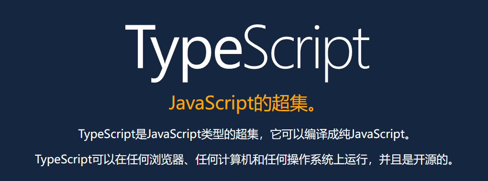
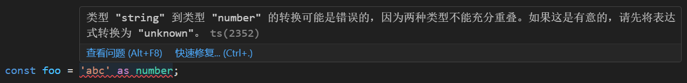

## TypeScript 知识分享


# 一、概述

TypeScript（简称 TS） 是由 Microsoft 开发的、基于 JavaScript（简称 JS） 的语言，可以被看作是 **JavaScript 的一个超集**。

<a href="http://tslang.cn/">
    
</a>

[TypeScript 中文网](http://tslang.cn/docs/home.html)

## 1.1 TypeScript 与 JavaScript 的关系

- TS 和 JS 之间的关系其实就像 Less/Sass 和 CSS 之间的关系：
  Less/Sass 是对 CSS 的扩展，TS 也是对 JS 的扩展，
  Less/Sass 最终会转换成 CSS，TS 代码最终也会转换成 JS。
- 所有的合法 JavaScript 代码都是合法的 TypeScript 代码，可以在 TypeScript 中直接使用 JavaScript 代码。
- JavaScript 是**弱类型**，很多错误只有在运行时才会被发现。
  TypeScript 是**强类型**，它提供了一套静态检测机制，可以帮助我们在编译时就发现错误。

## 1.2 TypeScript 特点

- 支持 Java, C#, C++ 等后端语言中的特性，例如枚举、泛型、类型转换、命名空间、声明文件、类、接口等
- 支持代码静态检查
- 支持 ECMAScript 的新特性，例如装饰器等

## 1.3 为什么要学习 TypeScript？

- 学习成本低（入门简单，精通也难）
- 能减少团队无效沟通
- 能让代码更健壮
- 有助于快速掌握其它后端语言
- ......

# 二、使用步骤

## 2.1 安装 TypeScript

通过 npm 安装：

```
npm install -g typescript
```

## 2.2 编译 TypeScript 文件

### 2.2.1 编译指定 ts 文件

```powershell
tsc src/index.ts
```

<details>
<summary>
<font size="2">
常见报错：tsc : 无法加载文件 C:\Users\Administrator\AppData\Roaming\npm\tsc.ps1，因为在此系统上禁止运行脚本。
</font>
</summary>

<font size="2">因为我们的系统执行策略（Execution Policy）禁止在系统上运行 PowerShell 脚本。
要解决此问题，可以尝试以下步骤：
1、按下【Win+X】，选择【Windows PowerShell（管理员）】，注意，需要带【管理员】后缀的 WIndows PowerShell。
2、查看系统的执行策略，如果输出结果是 Restricted，则说明系统禁止执行任何 PowerShell 脚本。

```powershell
Get-ExecutionPolicy
```

3、使用以下命令来将执行策略设置为 RemoteSigned，允许您在系统上执行本地脚本。

```powershell
Set-ExecutionPolicy RemoteSigned
```

</font>


</details>

#### 示例

编译前

```ts
// 可以完全按照 JavaScript 标准语法编写代码
const hello = (name) => {
  console.log(`Hello,${name}`);
};
hello("TypeScript");
```

编译后

```js
var hello = function (name) {
  console.log("Hello,".concat(name));
};
hello("TypeScript");
```

tsc 命令不仅仅可以编译指定的某个 ts 文件，还可以编译整个项目。

### 2.2.2 编译整个项目

```powershell
tsc
```

### 2.2.3 配置文件

创建 TypeScript 配置文件

```powershell
tsc --init
```

执行命令后，会生成一个 tsconfig.json 文件。

文件中 **compilerOptions** 是 TypeScript 编译器的选项。

##### 常用的 compilerOptions 选项

**target**： 设置编译过后 Javascript 所采用的 ECMA 标准

**module**： 输出的代码采用什么样的方式去进行模块化

**outDir**： 编译结果输出到的文件夹，一般会输出到 dist 文件夹

**rootDir**： 配置源代码，也就是 Typescript 代码所在的文件夹，一般放在 src 目录

**sourceMap**： 是否开启源代码映射，开启之后，调试的时候可以通过 sourceMap 文件进行源代码调试

**strict**： 开启所有严格检查选项，严格模式下，需要我们对每一个成员都要指定明确的类型等等

**......**

**_注意，如果还是使用 tsc 编译某个 ts 文件，配置文件是不起作用的，只有当直接运行 tsc 命令去编译整个项目时，配置文件才生效。_**

### 2.2.4 结合 webpack 使用

参考文档：[将 TypeScript 和 webpack 结合在一起使用](http://tslang.cn/docs/handbook/react-&-webpack.html)

# 三、TypeScript 基础类型

## 3.1 从类型注解讲起

### 3.1.1 类型注解

TS 里的类型注解是一种轻量级的为函数或变量添加约束的方式。形如：

变量名: 类型名

```ts
let count: number = 10;
```

TS 提供了静态的代码分析，它可以分析代码结构和提供的类型注解。

如果编译时推断出变量类型与类型注解不一致，编译器会报错，但 js 文件还是会被编译出来。

### 3.1.2 基础类型有哪些

当前版本 TS 中基础类型共有 13 种：
布尔型、数字、字符串、数组、元组、枚举、any、unknown、void、null、undefined、never、object。

### 3.1.3 boolean 类型

布尔类型，同 JS。

```ts
let isDone: boolean = false; // ES5: var isDone = false;
```

### 3.1.4 number 类型

和 JS 一样，TS 里的所有数字都是浮点数，类型是 number。支持 2、8、10、16 等各种进制。

NaN 和 Infinity 也属于 number 类型。

```ts
let count: number = 10; // ES5: var count = 10;
```

### 3.1.5 string 类型

同 JS，用 string 表示字符串类型，支持单引号、双引号和模板字符串。

```ts
let name: string = "Java"; // ES5: var name = 'Java';
```

## 3.2 数组和元组类型

### 3.2.1 单一类型的数组

```ts
let arr1: Array<number> = [1, 2, 3]; // ES5: var arr1 = [1, 2, 3];
let arr2: number[] = [1, 2, 3]; // ES5: var arr2 = [1, 2, 3];
let arr3: Array<string> = ["A", "B", "C"]; // ES5: var arr3 = ["A", "B", "C"];
let arr4: string[] = ["A", "B", "C"]; // ES5: var arr4 = ["A", "B", "C"];
```

### 3.2.2 联合类型的数组

```ts
let arr5: Array<boolean | string | number> = [1, "A", true]; // ES5: var arr5 = [1, "A", true];
let arr6: (boolean | string | number)[] = [1, "A", true]; // ES5: var arr6 = [1, "A", true];
```

### 3.2.3 任意类型的数组

```ts
let arr7: Array<any> = [1, "A", null]; // ES5: var arr7 = [1, "A", null];
let arr8: any[] = [1, "A", null]; // ES5: var arr8 = [1, "A", null];
```

### 3.2.4 元祖（Tuple）

TS 中的元祖类型是数组类型的扩展，是**明确元素数量以及每个元素类型的数组**。

元祖有以下特点：

1. 明确知道包含了多少元素（这里的元素指的是类型）
2. 明确知道每个类型所在的位置
3. 长度固定，元组类型的变量需要为每一个位置定义对应类型的值

总而言之，元祖赋值的元素类型必须和类型注解**一一对应**。

与数组一样，我们可以通过下标来访问元组中的元素。

```ts
let tuple1: [boolean, string, number] = [666, "A", 2333]; // 报错
let tuple2: [boolean, string, number] = [true, "A", 2333];
console.log(tuple2[2]); // 2333
```

<details>
<summary>错误示例</summary>


</details>

### 3.2.5 不可变元组（Immutable Tuple）

不可变元组的意思是元组类型的变量内的元素值是不可变的，也就是不可再增加元素、删除元素、修改元素值。

想要让一个元祖拥有这个特性，有两种办法：

```ts
// 1.在元祖类型字面量前加 readonly 关键字（注意不能加在类型变量名前）
type tupleTypeDemo = readonly [string, number];

// 2.给数组类型的变量（注意：不是类型）后加 const 断言，改为 “常量”
let demo = [
  {
    item: {
      name: "不可变",
    },
  },
  2333,
] as const;

demo[0].item.name = 1; // error: 无法为“name”赋值，因为它是只读属性。
demo.push(2); // error: 类型“readonly [{ readonly item: { readonly name: "不可变"; }; }, 2]”上不存在属性“push”。
demo.splice(0, 1); // error: 属性“splice”在类型“readonly [{ readonly item: { readonly name: "不可变"; }; }, 2]”上不存在。
demo.pop(); // error: 类型“readonly [{ readonly item: { readonly name: "不可变"; }; }, 2]”上不存在属性“pop”。
demo.unshift(); // error: 类型“readonly [{ readonly item: { readonly name: "不可变"; }; }, 2]”上不存在属性“unshift”。
```

### 3.2.6 元组合并

```ts
type tupleFirst = [number];
type tupleSecond = [string];
type intersectionTuple = [...tupleFirst, ...tupleSecond]; // [number, string]
```

## 3.3 枚举类型

### 3.3.1 枚举的基本概念

枚举类型是 TS 为 JS 扩展的一种类型，在原生 JS 中是没有枚举类型的。

TS 中的枚举类型是对**包含有限数量的命名常量的集合**的数据类型的**统称**。每一个定义出来的枚举都是独立的 TS 类型。

枚举的作用：

1. 定义一组具有意义的常量，可以通过名称或值调用这些常量，提高代码的可读性和可维护性。
2. 作为一种类型，用做类型注解。

<details>
<summary>扩展知识</summary>

绝大部分 TypeScript 的特性都遵循类型级别扩展的法则，而枚举打破了这个法则。
（类型级别扩展的法则：要得到 JavaScript 代码，只需要去掉类型标准即可。）

[TypeScript 的 enum 是一种错误吗？](https://www.zhihu.com/question/60168510/answer/2320750226)

[enum 虽好，但我选择 Const Assertions](https://www.zhihu.com/question/60168510/answer/733352978)

</details>

### 3.3.2 枚举的基本语法

TS 中使用关键字“enum”来定义一个枚举类型。

枚举类型有三种定义方式：数字枚举、字符串枚举、异构枚举（数字和字符串混合）。

- 数字枚举的取值，默认是从上至下从 0 开始递增，也可以手动指定枚举值。
- 数字枚举如果手动指定了前面的枚举值，那么后面的枚举值会根据前面的值来递增。

示例：

```ts
enum Direction {
  EAST,
  SOUTH,
  WEST,
  NORTH,
}

enum StringEnumDemo {
  A = "aaa",
  B = "bbb",
}

enum MixEnum {
  A = "aaa",
  B = 2,
}
```

编译后

```js
var Direction;
(function (Direction) {
  Direction[(Direction["EAST"] = 0)] = "EAST";
  Direction[(Direction["SOUTH"] = 1)] = "SOUTH";
  Direction[(Direction["WEST"] = 2)] = "WEST";
  Direction[(Direction["NORTH"] = 3)] = "NORTH";
})(Direction || (Direction = {}));

var StringEnumDemo;
(function (StringEnumDemo) {
  StringEnumDemo["A"] = "aaa";
  StringEnumDemo["B"] = "bbb";
})(StringEnumDemo || (StringEnumDemo = {}));
var MixEnum;

(function (MixEnum) {
  MixEnum["A"] = "aaa";
  MixEnum[(MixEnum["B"] = 2)] = "B";
})(MixEnum || (MixEnum = {}));
```

### 3.3.3 枚举的反向映射

TS 中枚举还提供了反向映射功能，允许通过枚举值获取其对应的常量名称。例如：

```ts
enum Direction {
  EAST,
  SOUTH,
  WEST,
  NORTH,
}
console.log(Direction[1]); // 输出：SOUTH
console.log(Direction[2]); // 输出：WEST
```

### 3.3.4 内联枚举（常量枚举）

TS 还支持内联枚举，这种类型的枚举**在编译时被删除并内联到引用的地方**。这可以提高性能，减少编译后代码的大小。例如：

```ts
const enum Gender {
  MALE,
  FEMALE,
}
let gender: Gender = Gender.FEMALE;
```

编译后

```js
var gender = 1; /* Gender.FEMALE */
```

<details>
<summary>扩展知识</summary>

es6 中 const 声明的常量仅在编译时约束了修改操作，实际并未进行值的内联替换。
这一点与 Java、C# 等强类型语言的常量是不同的。

```ts
const pi = 3.14;
console.log(pi);
```

编译后

```js
var pi = 3.14;
console.log(pi); // 未被替换为 3.14
```

</details>

### 3.3.5 常量枚举表达式

常量枚举表达式是指可以在编译时求值的表达式。这些表达式包括数字字面量、其他常数枚举表达式以及一些算术运算符。例如：

```ts
enum E {
  A = 1 << 0,
  B = 1 << 1,
  C = A | B,
}

enum SectionArea {
  A1 = 3.14 * 1 * 1,
  A2 = 3.14 * 2 * 2,
  A3 = 3.14 * 3 * 3,
}
```

编译后

```js
var E;
(function (E) {
  E[(E["A"] = 1)] = "A";
  E[(E["B"] = 2)] = "B";
  E[(E["C"] = 3)] = "C";
})(E || (E = {}));

var SectionArea;
(function (SectionArea) {
  SectionArea[(SectionArea["A1"] = 3.14)] = "A1";
  SectionArea[(SectionArea["A2"] = 12.56)] = "A2";
  SectionArea[(SectionArea["A3"] = 28.259999999999998)] = "A3";
})(SectionArea || (SectionArea = {}));
```

### 3.3.6 枚举合并

```ts
enum Color {
  RED = "red",
  GREEN = "green",
  BLUE = "blue",
}
enum Shape {
  CIRCLE,
  SQUARE,
  TRIANGLE,
}

type ColorShape = Color | Shape; // 类型联合
const ColorShape = { ...Color, ...Shape }; // 值合并

const obj1: ColorShape = Color.RED;
const obj2: ColorShape = Shape.SQUARE;
const obj3: ColorShape = ColorShape.GREEN;
const obj4: ColorShape = ColorShape.SQUARE;

// 再次定义同名枚举，可新增枚举值，但规则上不允许修改已存在的枚举值
enum Color {
  WHITE = "white",
  BLACK = "black",
  RED = "pink", // 报错：标识符“RED”重复。（强行编译后代码也可以生效，RED枚举值被新值覆盖）
}
const obj5: ColorShape = Color.BLACK;
```

编译后

```js
var Color;
(function (Color) {
  Color["RED"] = "red";
  Color["GREEN"] = "green";
  Color["BLUE"] = "blue";
})(Color || (Color = {}));
var Shape;
(function (Shape) {
  Shape[(Shape["CIRCLE"] = 0)] = "CIRCLE";
  Shape[(Shape["SQUARE"] = 1)] = "SQUARE";
  Shape[(Shape["TRIANGLE"] = 2)] = "TRIANGLE";
})(Shape || (Shape = {}));
var ColorShape = __assign(__assign({}, Color), Shape); // 值合并
var obj1 = Color.RED;
var obj2 = Shape.SQUARE;
var obj3 = ColorShape.GREEN;
var obj4 = ColorShape.SQUARE;
// 再次定义同名枚举，可新增枚举值，但规则上不允许修改已存在的枚举值
(function (Color) {
  Color["WHITE"] = "white";
  Color["BLACK"] = "black";
  Color["RED"] = "pink";
})(Color || (Color = {}));
var obj5 = Color.BLACK;
```

### 3.3.7 外部枚举（declare enum 定义的枚举）

外部枚举用来描述已经存在的枚举类型的形状，意思就是说外部枚举用来描述当前环境中存在的枚举对象。

外部枚举和普通枚举的一个区别就是，在外部枚举里面没有初始化的枚举成员会当成一个计算值，而在普通枚举里面则是一个常量。

外部枚举不会生成反向映射。

## 3.4 any、unknown、void、null 和 undefined 类型

### 3.4.1 any 类型

any 表示任意类型，当不清楚某个值的具体类型的时候，可以使用 any。比如，有一个数组，它包含了不同的类型的数据：

```ts
let list: any[] = [1, true, "free"];
list[1] = 100;
```

any 一般用于定义一些通用性比较强的变量，或者用于保存从其它框架中获取的不确定类型的值。

在 TS 中**任何数据类型的值都可以赋值给 any 类型**。

使用 any 会让我们失去类型检查的优势，也破坏了类型推断，导致编译器无法推断变量的类型，使得开发者失去了一些代码提示和自动完成的功能。所以开发中应该尽量避免使用 any 类型。

<details>
<summary>扩展知识：TypeScript 为什么要引入 any 类型？</summary>

引入 any 类型的主要原因有一些历史和实用性的考虑：

- **平滑迁移**： TypeScript 最初是为 JavaScript 代码添加类型检查而设计的，而 JavaScript 是一门非常灵活的动态语言。为了让开发者能够逐步引入类型检查而不破坏现有代码，引入了 any 类型。这使得开发者可以在 TypeScript 项目中逐步迁移 JavaScript 代码而不会立即遇到大量的类型错误。
- **与动态语言的互操作性**： 有些库或框架可能并没有提供完整的 TypeScript 类型定义，或者是通过动态类型来实现某些功能。在这种情况下，使用 any 类型可以更容易地与这些库进行集成。
- **不明确类型**： 有时候，某个值的类型可能非常复杂或难以明确表示，或者我们可能并不关心其具体类型。使用 any 类型可以简化代码，让 TypeScript 编译器对该值进行较少的类型检查。

</details>

### 3.4.2 unknown 类型

如果确实有些类型在最开始使用的时候无法确认，可以使用 unknown 类型。

unknown 类型是 TS3.0 中新增的一个顶级类型，被称作安全的 any。

unknown 类型是所有类型的子类型，表示未知的值。与 any 类型相似，任何类型都可以赋值给 unknown 类型的变量。

```ts
let value: unknown;
value = true; // OK
value = 42; // OK
value = "Hello World"; // OK
value = []; // OK
value = {}; // OK
value = Math.random; // OK
value = null; // OK
value = undefined; // OK
value = new TypeError(); // OK
value = Symbol("type"); // OK
```

当尝试将类型为 unknown 的值赋值给其他类型的变量时会发生什么？

```ts
let value: unknown;
let value1: unknown = value; // OK
let value2: any = value; // OK
let value3: boolean = value; // Error
let value4: number = value; // Error
let value5: string = value; // Error
let value6: object = value; // Error
let value7: any[] = value; // Error
let value8: Function = value; // Error
```

#### unknown 和 any 的区别

在对 any 类型的值执行操作之前，我们不必进行任何检查。

而在对 unknown 类型的值执行大多数操作之前，必须进行某种形式的检查（类型断言或基于控制流的类型细化），以收窄我们正在处理的值的类型。

注：直接对 unknown 类型进行相等或不等判断以及非严格模式下的其他关系判断（例如 >=）不会报错

```ts
let value1: unknown = 123;
let value2: unknown = 123;
console.log(value1 === value2); // OK
console.log(value1 !== value2); // OK
console.log(value1 == value2); // OK
console.log(value1 != value2); // OK
console.log(value1 >= value2); // 严格模式报错
console.log(value1 > value2); // 严格模式报错
```

#### 收窄 unknown 类型

以下是使用 typeof 收窄 unknown 类型的一个例子：

```ts
function processValue(value: unknown): string {
  // return value.toUpperCase(); // 直接操作 unknown 类型的值，报错
  // 使用 typeof 进行类型检查
  if (typeof value === "string") {
    return value.toUpperCase(); // 在这里，TypeScript 知道 value 的类型是 string
  } else {
    return `${value}不是string类型`; // 在这里，TypeScript 知道 value 的类型不是 string
  }
}
console.log(processValue("black")); // 输出: BLACK
console.log(processValue(666)); // 输出: 666不是string类型
```

### 3.4.3 void 类型

void 与 any 正好相反，表示没有任何类型，一般用于函数返回值。

在 TS 中只有 null（非严格模式下） 和 undefined 可以赋值给 void 类型。

注意：非严格模式下，可以将 null 和 undefined 赋值给任意类型。

```ts
let value: void;
value = 123; // 报错
value = "abc"; // 报错
value = true; // 报错
value = null; // 严格模式报错
value = undefined; // 不会报错

let value2: number;
value2 = undefined; // 严格模式报错
```

### 3.4.4 null 和 undefined

TS 中，null 和 undefined 两者各有自己的类型，分别就叫 null 和 undefined。

```ts
let n: null = null; // 只能用 null 赋值
let u: undefined = undefined; // 只能用 undefined 赋值
```

默认情况下 null 和 undefined 是所有类型的子类型，可以把 null 和 undefined 赋值给 number 类型的变量。

#### 严格空值检查模式（strictNullChecks = true）

如果开启了严格空值检查模式（默认开启），null 和 undefined 无法赋值给其他类型的变量，只能赋值给 void 和它们自身的类型。

例如下面的代码在 strictNullChecks 为 true 时，是无法编译通过的：

```ts
let str: string;
str = "ABC"; // OK
str = null; // 报错（严格空值检查模式）
str = undefined; // 报错（严格空值检查模式）
```

此时若想传入 null 或 undefined，可以使用联合类型 string | null | undefined。

```ts
let str: string | null | undefined;
str = "ABC"; // OK
str = null; // OK
str = undefined; // OK
```

## 3.5 never 和 object 类型

### 3.5.1 never 类型

never 类型表示的是永不存在的值的类型，一般用于抛出异常或根本不可能有返回值的函数。

```ts
function demo(): never {
  throw new Error("err");
}
function demo2(): never {
  while (true) {}
}
```

### 3.5.2 object 类型

#### object 与 Object 有什么区别？

object 是 TS 中的类型（在 JS 中不存在），它是非基本数据类型的统称，包括 Array（数组），Function（函数），Tuple（元组），Object（对象）等等。

而 Object 可以看成是 JS 中的全局 Object 对象，它包括所有 JS 内置的对象类型，我们常说的万物皆对象说的就是 Object。

一句话总结：Object 包含了所有 JS 内置对象类型，而 object 包含了所有非原始类型的值。

```ts
const obj01: Object = 1; // 正常运行
const obj02: object = 1; // error 不能将类型“number”分配给类型“object”
```

如果一个变量的类型是 object，那么它可以存储任何引用类型的值。示例代码如下：

```ts
const obj: object = {}; // 对象
const arr: object = [1, 2, 3]; // 数组
const fn: object = function () {}; // 函数
const tuple: object = ["count", 10]; // 元组
const map: object = new Map(); // 键值对集合
const set: object = new Set(); // 无序集合
```

上述代码写法不会报错，但是无法使用特有的属性或函数，如执行 fn()，会提示无法执行，使用 map.set 会找不到该函数。
解决方法是使用更具象的类型来表示变量，如：

```ts
const obj: Object = {};
const arr: number[] = [1, 2, 3];
const fn: Function = function () {};
const tuple: [string, number] = ["count", 10];
const map: Map<number, string> = new Map();
const set: Set<string> = new Set();
obj.valueOf();
arr.push(4);
fn();
tuple.push(1);
map.set(0, "0");
set.add("hello");
```

## 3.6 类型断言

### 3.6.1 类型断言的概念

在 TS 中，类型断言就是告诉编译器你比它更了解该数据类型，不要再检查了。

类型断言只会在编译时影响类型检查，在运行时不会生成任何代码，不会改变运行结果。

```ts
interface Foo {
  a: number;
  b: string;
}
const foo1: Foo = {}; // 报错：类型“{}”缺少类型“Foo”中的以下属性: a, b
const foo2: Foo = {} as Foo;
```

编译后

```js
var foo1 = {};
var foo2 = {};
```

### 3.6.2 类型断言的两种写法：

- 值 as 类型
- <类型>值

```ts
let str: any = "anyscript";
// 写法一（推荐）
let len1 = (str as string).length;
// 写法二
let len2 = (<string>str).length;
```

第二种写法跟 jsx 语法有冲突，写在 tsx 文件里会报错。
另外它跟 TS 泛型写法类似，容易混淆。所以建议都用第一种写法。

<details>
<summary>扩展知识：as 写法注意区分映射类型中 key 重映射的 as 从句</summary>

映射类型中 key 的重映射可能会用到跟类型断言一样的 as 关键字，但它不属于类型断言，这里简单介绍说明一下。

映射类型中 key 的重映射形式如下：

```ts
type MappedTypeWithNewKeys<T> = {
  [K in keyof T as NewKeyType]: T[K];
};
```

具体应用：

- 结合模板字面量类型将 key 转成 getKey。

```ts
interface Person {
  name: string;
  age: number;
  location: string;
}
type Getters<T> = {
  [K in keyof T as `get${Capitalize<string & K>}`]: () => T[K];
};
type LazyPerson = Getters<Person>;
```

- 类型体操 PickByType，类似于实现 TS 内置的 Pick 类型。

```ts
type PickByType<T, U> = {
  [P in keyof T as T[P] extends U ? P : never]: T[P];
};
```

</details>

### 3.6.3 类型断言的应用

举个例子，假设有这样一段 html：

```html
<body>
  <canvas id="my-canvas"></canvas>
</body>
```

我们想获取该 canvas 的 2d 上下文

```ts
const canvasEle = document.getElementById("my-canvas");
const context = canvasEle.getContext("2d"); // 报错
```

这时 TS 会报错：类型“HTMLElement”上不存在属性“getContext”。

但我们可以确定 document.getElementById('my-canvas') 能拿到一个 canvas 元素，所以我们可以通过 as HTMLCanvasElement 断言它是一个 canvas 元素来消除 TS 错误。

```ts
const canvasEle = document.getElementById("my-canvas") as HTMLCanvasElement;
const context = canvasEle.getContext("2d"); // 现在不会报TS错误
```

### 3.6.4 类型断言的限制

类型断言并非可以随意使用，值的类型需要和断言的类型兼容，像下面的断言就会报错：

```ts
const foo = "abc" as number; // 报错
```



### 3.6.5 双重断言（慎用）

如果想要强制进行任何类型的断言，可以使用双重断言。因为 any 和 unknown 与其他类型都兼容，所以可以通过 any 和 unknown 为中转进行双重断言，以避免断言错误：

```ts
const foo = "abc" as unknown as number; // 现在不会报TS错误
```

使用场景：写单元测试 mock 函数时可能会用到，其他场景慎用。

### 3.6.6 慎用类型断言

考虑下面这段代码

```ts
interface Foo {
  a: number;
  b: string;
}
const foo = {};
foo.a = 1; // 报错：类型“{}”上不存在属性“a”。
foo.b = "hello"; // 报错：类型“{}”上不存在属性“b”。
```

类似的情况大家在日常中经常接触，ts 会报错。解决办法之一是将 {} 断言成 Foo：

```ts
const foo = {} as Foo;
foo.a = 1; // 不报错
foo.b = "hello"; // 不报错
```

但这样子会丢失 TS 发现错误的能力，假如我们给 foo.a 赋值之前就使用它：

```ts
const foo = {} as Foo;
const total = foo.a + 2; // NaN
```

得到的 total 并不符合我们预期，而 TS 并没有任何提示。

所以，能不使用类型断言我们尽量不要使用。

当你想用类型断言的时候，可以先看看能否换成类型声明。

### 3.6.7 const 断言

const 断言写法与类型断言相似：值 as const 或 \<const\>值。

const 断言有以下几个作用：

- 字面量类型不会扩宽，如下面的 x 类型是"hello"而不是 string。
- 数组字面量变成只读元组。
- 对象字面量属性变成只读。

```ts
let x = "hello" as const; // Type '"hello"'
let y = [10, 20] as const; // Type 'readonly [10, 20]'
let z = { text: "hello" } as const; // Type '{ readonly text: "hello" }'
```

#### const 断言有什么用呢？

一种使用场景是，禁止修改对象。例如前面讲的不可变元组，或者定义一个只读对象：

```ts
const Colors = {
  RED: "red",
  GREEN: "green",
  BLUE: "blue",
} as const;
Colors.RED = "pink"; // 报错：无法为“red”赋值，因为它是只读属性。
```

另外一种使用场景，看下面的例子：

```ts
function sum(a: number, b: number) {
  return a + b;
}
const arr = [3, 4];
console.log(sum(...arr)); // 报错：扩张参数必须具有元组类型或传递给 rest 参数。
```

TS 会报错，spread 传入实参需要是元组或者接收 rest 形参。原因在于如果 arr 不是元组，在 sum 调用之前 arr 可能被改变，比如下面调用 splice 方法：

```ts
const arr = [3, 4];
arr.splice(0, 1);
console.log(sum(...arr));
```

这样，sum 方法只能接收到一个参数，计算就会出错。

最简单的解决办法是，使用 const 断言将 arr 转成元组类型：

```ts
function sum(a: number, b: number) {
  return a + b;
}
const arr = [3, 4] as const;
console.log(sum(...arr));
```

### 3.6.8 类型断言总结

- 当我们比 TS 更清楚值的类型时，可以通过类型断言手动指定。
- 类型断言有两种写法，建议统一使用 as 关键字。
- 类型不兼容时类型断言会报错，可以使用双重断言解决，但要慎用双重断言。
- 类型断言是编译时的概念，不等同于运行时的类型转换。
- 尽量少用类型断言，因为它可能会隐藏掉代码中的坏味道。
- const 断言是一种特殊的类型断言，某些场景下比较有用。

# 四、TypeScript 高级类型

## 4.1 接口（interface）

TypeScript 的核心原则之一是对值所具有的结构进行类型检查。

在 TypeScript 中，接口的作用就是为这些类型命名和为我们的代码或第三方代码定义契约。

### 4.1.1 接口的定义

TS 中使用关键字“interface”来定义一个接口类型，用来约束对象、函数、类等非基本数据的结构。

### 4.1.2 接口的各类属性

1、基础属性：必须包含，类型必须匹配。

2、可选属性：属性名后加“?”，表示可有可无，如果有，类型必须匹配。

3、只读属性：用 readonly 修饰符，值不允许修改，只能在对象创建的时候给初始值。

<details style="margin:1em;">
<summary>readonly 与 const 的区别</summary>
最简单判断该用 readonly 还是 const 的方法：作为变量用 const，作为属性则用 readonly。
</details>

4、额外属性：除了已列出的属性，还可以添加其他的属性名不确定的键值对。

用接口限制一个数据, 必须把所有可能会出现的属性都写上吗？万一只能确定部分属性, 其他的不确定怎么办呢？这时候可以用额外属性。

```ts
interface UserInfo {
  userName: string; // 基础属性
  gender?: number; // 可选属性
  readonly userId: string; // 只读属性
  readonly status?: number; // 只读可选属性
  [props: string]: any; // 值类型为 any 的额外属性
}
let user: UserInfo = {
  userName: "Jone",
  userId: "u1s1",
};
user.gender = 1; // 后添加可选属性
user.userId = "2333"; // 报错：无法为“userId”赋值，因为它是只读属性。
user.status = 2; // 报错：无法为“status”赋值，因为它是只读属性。
user.age = 18; // 额外属性
user.city = "nanjing"; // 额外属性
user[0] = "TEST"; // 索引 0 会被转为字符串"0"

// 有个办法可以变相绕过只读限制：将对象赋值给另一个变量
user = {
  userName: "Jone",
  userId: "2333",
  status: 2,
}; // 不报错
```

严格来说，额外属性不建议随便使用，我们最好准确把握自己写的数据类型。
否则，如果利用额外属性给接口约束的变量随意添加属性，接口的意义就不是很大了。
例如，上面的例子，如果不小心给一个叫“username”的属性赋值，TS 并不会报错，这与我们的预期是不符的。

```ts
// username 不是 userName
user.username = "Tony"; // 不报错
```

### 4.1.3 函数型接口

接口除了能约束带有属性的普通对象外，也可以约束函数类型。

接口对于函数的约束有两个部分：参数和返回值。

```ts
interface SearchFunc {
  (x: number, y: string): string;
}
const fn: SearchFunc = function (x, y) {
  return x + y;
};
```

### 4.1.4 索引型接口

TypeScript 支持两种索引签名：字符串和数字。可以同时使用两种类型的索引，但是数字索引的返回值必须是字符串索引返回值类型的子类型。这是因为当使用 number 来索引时，JavaScript 会将它转换成 string 然后再去索引对象。也就是说用 100（number）去索引等同于使用"100"（string）去索引，因此两者需要保持一致。

```ts
class Animal {
  name: string;
}
class Dog extends Animal {
  breed: string;
}
// 错误：使用数值型的字符串索引，有时会得到完全不同的Animal!
interface NotOkay {
  [x: number]: Animal;
  [x: string]: Dog;
}
```

字符串索引签名能够很好的描述 dictionary 模式，并且它们也会确保所有属性与其返回值类型相匹配。 因为字符串索引声明了 obj.property 和 obj["property"]两种形式都可以。 下面的例子里， name 的类型与字符串索引类型不匹配，所以类型检查器给出一个错误提示：

```ts
interface NumberDictionary {
  [index: string]: number;
  length: number; // 可以，length是number类型
  name: string; // 错误，`name`的类型与索引类型返回值的类型不匹配
}
```

最后，你可以将索引签名设置为只读，这样就防止了给索引赋值：

```ts
interface ReadonlyStringArray {
  readonly [index: number]: string;
}
let myArray: ReadonlyStringArray = ["Alice", "Bob"];
myArray[2] = "Mallory"; // error!
```

你不能设置 myArray[2]，因为索引签名是只读的。

索引型接口有一个用法是用接口去约束一个数组，等价于普通约束数组的方式，不同之处在于接口有自定义的名称。

```ts
interface StringArray {
  [index: number]: string;
}
let list: StringArray = ["A", "B"];
// 等价于
let list2: string[] = ["A", "B"];
```

### 4.1.5 类（class）接口

类接口要完整讲清楚的话非常复杂。

一般业务开发过程中很少会对类进行限制，因为类其实本身就是一种限制。

框架开发可能会用到，例如 Angular。
